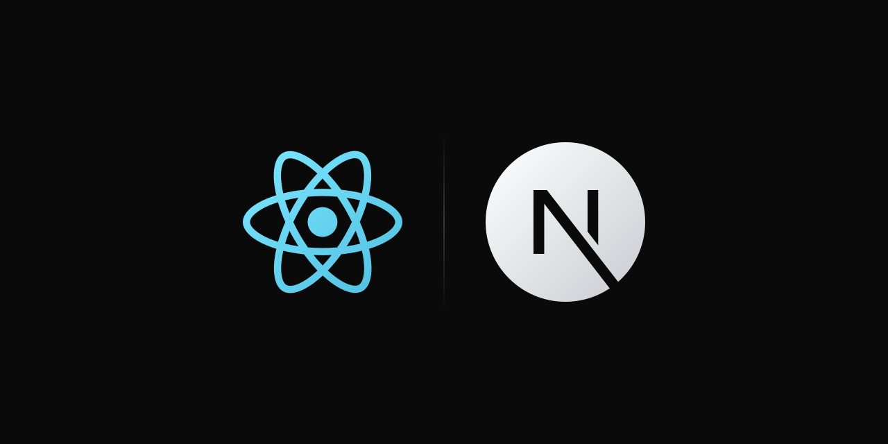

---

# ⚛️ Stack Frontend del Proyecto
A continuación se resumen las principales tecnologías del proyecto y el motivo por el que se utilizan. No se incluyen todas las dependencias.

* Node.js 24.21.0

* [**Next.js 16 con App Router (`app`):**](https://youtu.be/_SPoSMmN3ZU?si=QCw1smESqt2qE_6a) _Framework semi-opinionado_ que evita configurar el proyecto desde cero, a diferencia de _React + Vite_, que es mas _abierto_. Incluye soporte nativo para _SSR (Server-Side Rendering)_, _SSG (Static Site Generation)_, _ISR (Incremental Static Regeneration)_ y _CSR (Client-Side Rendering)_.

* [**React 19:**](https://youtu.be/rLoWMU4L_qE?si=JIle2kdd3Etv5D41) Es la _biblioteca de frontend_ mas usada, tiene muchas _librerias_ que ofrecen soluciones a muchos problemas.

* [**TypeScript 7:**](https://youtu.be/fUgxxhI_bvc?si=rRY7NTzsONRSwyNN) Agrega _tipado estático_ al lenguaje, permitiendo detectar errores durante el desarrollo y mejorar el _autocompletado_, la _refactorización_ y el _mantenimiento del código_. Además, permite tener el mismo lenguaje de programación en frontend y backend.

* [**Shad cn:**](https://youtu.be/URpcaFga8rY?si=F9o2SuH-U5FKLkqw)
1. Tiene una lista de _componentes UI_ muy completa, con integración nativa con Tailwind y soporte para React Hook Form.

2. Usar una librería de UI permite abstraer lógica; la librería ya se encarga de crear los componentes y de manejar los estados. Solo tiene que usar los componentes de UI.

3. Para componentes de UI como formularios y ventanas modales no se usa etiquetas nativas de HTML porque implica tener que "programar a mano" una librería de UI y seria reinventar la rueda

4. Shad cn es lo mas balanceado que hay entre una libreria que es totalmente Headless y una libreria de UI muy opinionada, es decir, por ejemplo modificar los estilos de [Material UI](https://mui.com/) se puede, pero es complejo y si usas una libreria totalmente Headless como [Headless UI](https://headlessui.com/) vas a enfrentarte con el problema de tener que escribir muchos estilos manualmente. Shad cn es un punto medio: Tiene estilos por defecto pero permite editarlos facilmente usando CSS y Tailwind

5. Para modificar los estilos de Shad cn no se requiere usar hacks de CSS como `::ng-deep` o `!important`

* [**React Hook Form 7:**](https://youtu.be/1MxevPIZgVc?si=Sa1YjhpGw-mQ0dST)
1. Mediante [`Controller`](https://react-hook-form.com/docs/usecontroller/controller) se integra React Hook Form con los componentes de formularios de Shad cn

2. Evita el _boilerplate_ de los formularios mediante [`register`](https://react-hook-form.com/docs/useform/register) y [`watch`](https://react-hook-form.com/docs/useform/watch) de React Hook Form porque abstrae la logica de gestionar manualmente el estado con formularios controlados ([`useState`](https://react.dev/reference/react/useState)), formularios no controlados ([`useRef`](https://react.dev/reference/react/useRef) ) y `onChange`

* [**Zod 4:**](https://youtu.be/bUzGfrjg66M?si=PqQtfsXKDVA0HnuP)

1. Permite utilizar la _misma sintaxis de código_ y reutilizar los mismos _esquemas de validación_ en frontend y backend de Node.js.

En frontend valida _formularios_ y _datos de entrada_, con integración con _React Hook Form_ (React) y [_Forms with Signals_ (Angular)](https://angular.dev/guide/forms/signals/validation). En backend valida _`body`_, _`query`_ y _`params`_ de las _solicitudes http_, garantizando la integridad de los datos antes de procesarlos.

2. El mismo esquema de Zod se reutiliza para crear tipos de datos de TypeScript

3. Se integra con TypeScript, ofrece validación de tipos en _tiempo de compilación_ y validación de datos en _tiempo de ejecución (runtime)_

* [**CSS:**](https://youtu.be/K3xmRF8ab1o?si=w1Ox_P5e2R934Xby)

1. No es necesario usar Sass, porque CSS ya tiene de forma nativa:
  * [CSS anidado (CSS nesting)](https://developer.mozilla.org/en-US/docs/Web/CSS/Guides/Nesting). Ejemplo:

```CSS
div.parent {
  color: blue;

  p.child {
    color: red;
  }
}
```

  * [Variables de CSS (CSS custom properties)](https://css-tricks.com/a-complete-guide-to-custom-properties/). Ejemplo:

```CSS
:root {
  --spacing: 16px;
}

.button {
  padding: var(--spacing);
}
```

Estas son 2 de las principales razones por las que se decide usar Sass y no CSS, pero en versiones mas nuevas de CSS, se empezo a implementar funciones que antes solamente estaban en Sass

2. [`@layer`](https://css-tricks.com/css-cascade-layers/) resuelve problemas de [_especificidad_](https://css-tricks.com/specifics-on-css-specificity/) y [_cascada_](https://developer.mozilla.org/en-US/docs/Learn_web_development/Core/Styling_basics/Handling_conflicts) al controlar el orden de prioridad entre las _capas_, reduciendo la necesidad de usar [`!important`](https://css-tricks.com/when-using-important-is-the-right-choice/)

3. [Tailwind 4 no se puede configurar con Sass](https://tailwindcss.com/docs/compatibility)

* [**Tailwind CSS 4:** ](https://youtu.be/R5EXap3vNDA?si=9TV4hucexfUBXgGk) Usa _clases utilitarias (utility classes)_, esto significa que si tienes conocimiento en CSS, cada clase de CSS tiene su equivalente en Tailwind. Ejemplo: En CSS se escribe

```CSS
div {
  display: flex;
}
```

y en Tailwind se escribe

```TSX
<div className="flex">
  {/* ... */}
</div>
```

En este proyecto se usa CSS para estilos globales y Tailwind para los estilos de cada componente

* [**tailwind-merge 3 y clsx 2:**](https://youtu.be/cJsRaYmrSQM?si=_DdWe3mQwTBAA1jo) Ambos se integran con _Tailwind_. _`clsx`_ evita escribir el _boilerplate_ en los _estilos condicionales_ que genera el _operador condicional ternario_, _template strings_, _concatenacion de strigs_, _`if`_ y _`switch`_, mientras que _`tailwind-merge`_ resuelve conflictos entre _clases de Tailwind_ que se sobrescriben.

* [**Zustand 5:**](https://youtu.be/pAHPHivDbuE?si=mUAwvgn-O1UhVva6) Es un _manejador de estado global_. Evita el codigo complejo que genera crear un `provider` de [`useContext()`](https://react.dev/reference/react/useContext) o `reducer` de [Redux](https://youtu.be/2_w3DnIKHxM?si=QVObWafdLHGpRUPi). En Zustand creas una funcion, la exportas y usas el estado global donde lo necesites.

* [**Luxon 3:**](https://moment.github.io/luxon/) Corrige los errores de `new Date()` de JavaScript y y tiene una API muy completa para manejo de fechas.

* [**react-icons 5:**](https://react-icons.github.io/react-icons/) Contiene iconos para todo. Los iconos provienen de muchas librerías de iconos y se pueden personalizar con _Tailwind_.

> [!TIP]
> # 🎥 **Aprende**
>
> Puedes hacer clic en el nombre de cada tecnología para ver cursos y aprenderlas

# ⚙️ Configurar lo Siguiente **UNA SOLA VEZ**

## 🛠️ Antes de Empezar
Para que la configuración funcione, debes tener instalado:
* [VS Code](https://code.visualstudio.com/) o cualquier editor basado en VS Code ([Antigravity IDE](https://antigravity.google/product/antigravity-ide), [Cursor](https://cursor.com/get-started), Windsurf, etc.)

* [Git Bash](https://youtu.be/niPExbK8lSw?si=tHx4IYZBdrUmW6ey)

* [Node.js](https://nodejs.org/)

* [Claude Code](https://youtu.be/Bf7hfpItrDk?si=5pW919OUbtSqJlyP)

* [pnpm](https://pnpm.io/installation)

* [fnm](https://github.com/Schniz/fnm)

> [!TIP]
> # ⚡ **Empieza de inmediato**
>
> 👍 Si quieres empezar a programar con IA sin perder tiempo configurando herramientas, utiliza **Claude Code**. Este proyecto ya incluye las configuraciones de **MCP**, **Skills** y [`AGENTS.md`](https://youtu.be/eS5HmdpcqnM?si=D7X-HFPQAfCkZ4Ks) listas para usar.
>
> 👎 Si prefieres otra IA, deberás configurar manualmente sus funcionalidades equivalentes según la forma en que esa herramienta las implemente.

## Instalar `pnpm`
1. Abrir Git Bash

2. Instalar:

```console
npm install -g pnpm@latest-11
```

3. Cerrar y volver abrir Git Bash

4. Si la instalacion es correcta, al ejecutar

```console
pnpm -v
```

Debe mostrar la version de `pnpm` instalada

## `fnm`
Para que `fnm` automáticamente al entrar a la carpeta del proyecto seleccione la versión correcta de Node.js que se especifica en el archivo `.nvmrc` que esta en la raiz del proyecto. Hacer esto:

1. Abrir Git Bash.

2. Instalar Node.js 24.21.0:

```console
fnm install 24.21.0
```

3. Copiar completo el siguiente comando y ejecutarlo:

```console
echo 'eval "$(fnm env --use-on-cd)"' >> ~/.bashrc
source ~/.bashrc
```

4. Cerrar y volver abrir Git Bash

5. Para verificar que funcione ejecutar los siguientes comandos en el siguiente orden:

```console
cd /ruta/a/carpeta/raiz/del/proyecto
```

```console
fnm current
```

```console
node -v
```

6. Debería mostrarte `v24.21.0` automáticamente, sin que hayas escrito manualmente

```console
fnm use 24.21.0
```

## ⌨️ Autocompletado, Formatear Código y Linter
Usar VS Code o cualquier editor basado en VS Code (Antigravity, Cursor, Windsurf, etc.) para instalar las siguientes extensiones:

* [Tailwind CSS IntelliSense](https://marketplace.visualstudio.com/items?itemName=bradlc.vscode-tailwindcss)

* [ESLint](https://marketplace.visualstudio.com/items?itemName=dbaeumer.vscode-eslint)

* [Error Lens](https://marketplace.visualstudio.com/items?itemName=usernamehw.errorlens)

* [EditorConfig](https://marketplace.visualstudio.com/items?itemName=EditorConfig.EditorConfig)

* [Prettier - Code formatter](https://marketplace.visualstudio.com/items?itemName=esbenp.prettier-vscode)

* [Console Ninja](https://marketplace.visualstudio.com/items?itemName=WallabyJs.console-ninja)

* [ES7+ React/Redux/React-Native snippets](https://marketplace.visualstudio.com/items?itemName=dsznajder.es7-react-js-snippets)

* [Path Intellisense](https://marketplace.visualstudio.com/items?itemName=christian-kohler.path-intellisense)

* [Auto Import](https://marketplace.visualstudio.com/items?itemName=steoates.autoimport)

* [Auto Close Tag](https://marketplace.visualstudio.com/items?itemName=formulahendry.auto-close-tag)

* [Auto Rename Tag](https://marketplace.visualstudio.com/items?itemName=formulahendry.auto-rename-tag)

* [HTML CSS Support](https://marketplace.visualstudio.com/items?itemName=ecmel.vscode-html-css)

No es necesario buscar cada extensión manualmente en el marketplace: el archivo `.vscode/extensions.json` ya está configurado con esas extensiones como recomendadas. Al abrir el proyecto, el editor mostrará una notificación sugiriendo instalarlas; también puede instalarlas desde la pestaña **Extensions** filtrando por `@recommended`.

La configuración de autocompletado, formateo de código y linter ya está incluida en los siguientes archivos. No es necesario realizar modificaciones adicionales:

* `.vscode/`
* `.editorconfig`
* `.prettierrc`
* `eslint.config.mjs`

# ⚙️ Entorno de Ejecución
Usar Node.js, prohibido usar alternativas como:

* [Bun](https://bun.com/)
* [Deno](https://deno.com/)

# 📦 Manejador de Paquetes
Usar `pnpm`, `pnpm-lock.yaml` y `pnpm dlx <paquete>` version `>=11.0.0 <12.0.0`. Esta 🚫 **BLOQUEADO** el uso de otras alternativas como:

| Concepto ⬇️ / Nombre manejador de paquetes ➡️            | `npm`                                   | `yarn`                              |
| --------------------------------------------------------- | --------------------------------------- | ----------------------------------- |
| Lockfile                                                  | `package-lock.json`                     | `yarn.lock`                         |
| Ejecutar un paquete temporal (sin instalarlo globalmente) | `npx <paquete>`<br>`npm exec <paquete>` | `yarn dlx <paquete>` *(Yarn Berry)* |

# 🟢 Administrador de Versiones para Node.js
Usar `fnm`. Está prohibido usar alternativas como:

* nvm
* volta

Este proyecto usa Node.js 24.21.0

# 🏷️ Alias
Para todos los comandos de `pnpm` usar el alias `pn`

# 📦 Instalar Paquetes

Este comando instala los paquetes que estan en `package.json` que son Next.js, React, TypeScript, Tailwind, etc:

```console
pn i
```

# ▶️ Scripts de Desarrollo

| Comando          | Ambiente    | Variable de Entorno            |
| ---------------- | ----------- | ------------------------------ |
| `pn start:local` | Local host  | `environments/.env.localhost`  |
| `pn start:test`  | Pruebas     | `environments/.env.test`       |
| `pn start:prod`  | Producción  | `environments/.env.production` |

# 🚀 Generar Carpeta `.next` (`build`) para Desplegar

| Comando         | Ambiente    | Variable de Entorno            |
| --------------- | ----------- | ------------------------------ |
| `pn build:test` | Pruebas     | `environments/.env.test`       |
| `pn build:prod` | Producción  | `environments/.env.production` |

# Ejecutar Carpeta `.next` con Archivos de Compilación
`pn start` ejecuta en `http://localhost:2000` los archivos ya compilados dentro de la carpeta `.next`. NO recibe ni lee variables de entorno.

## Regla
El ambiente queda **hardcodeado dentro de la carpeta `.next`** durante el build. NO se define al ejecutar `pn start`.

***Motivo:*** Next.js reemplaza cada `process.env.NEXT_PUBLIC_*` por su valor literal mientras compila. Por eso el ambiente ya viene incrustado en los archivos que generaron `pn build:test` o `pn build:prod`, y `pn start` únicamente los sirve.

## Pasos
1. Generar la carpeta `.next` con el ambiente deseado, usando uno de los comandos de la sección [Generar Carpeta `.next` (`build`) para Desplegar](#-generar-carpeta-next-build-para-desplegar)

2. Ejecutar la carpeta `.next`

```bash
pn start
```

3. En el navegador abrir `http://localhost:2000`

## Cambiar de Ambiente
Volver a ejecutar `pn start` NO cambia el ambiente. Para cambiarlo, generar de nuevo la carpeta `.next` con `pn build:test` o `pn build:prod` según el ambiente requerido, y después ejecutar `pn start`.

# 🪲 Scripts para Hacer Debugging

> [!TIP]
> # Deja de escribir `console.log()` para ver valores de variables y estados, mejor usa el debugging

| Comando          | Ambiente      | Variable de Entorno            | Configuración de `.vscode/launch.json` |
| ---------------- | ------------- | ------------------------------ | -------------------------------------- |
| `pn start:local` | Local host    | `environments/.env.localhost`  | `🪲 debugging en Chrome local host`    |
| `pn start:test`  | Pruebas       | `environments/.env.test`       | `🪲 debugging en Chrome pruebas`       |
| `pn start:prod`  | Producción    | `environments/.env.production` | `🪲 debugging en Chrome produccion`    |

Para que los scripts `start:*` sirvan para depurar se tiene que escribir `debugger;` en el código.

**Ejemplo:**

```tsx
'use client';
import { useEffect } from 'react';

export function ExampleComponent() {
  useEffect(() => {
    const NODE_ENV = process.env.NEXT_PUBLIC_NODE_ENV;
    alert(`Ambiente ${NODE_ENV}`);
    debugger; // debugger breakpoint
  }, []);

  return <h1>Ambiente</h1>;
}
```

## 🤔 Diferencia entre Navegador y Launch
Existen dos formas de ejecutar el debugger desde VS Code (o cualquier editor basado en VS Code).

|                                                                             | **Launch**                                                                                          | **Navegador**                                                                              |
| --------------------------------------------------------------------------- | --------------------------------------------------------------------------------------------------- | ------------------------------------------------------------------------------------------ |
| ¿Quién arranca el frontend?                                                 | El editor, al presionar `F5`                                                                        | El desarrollador, en la terminal                                                           |
| ¿Quién elige el entorno?                                                    | La configuración de `launch.json` y `tasks.json`                                                    | El script que se ejecutó en la terminal                                                    |
| Frontend ya en ejecución                                                    | Lo arranca de cero                                                                                  | Se adjunta al que ya está corriendo                                                        |
| ¿Quién abre el navegador?                                                   | VS Code abre automáticamente una nueva ventana del navegador                                        | El desarrollador debe abrir el navegador manualmente                                       |
| ¿Donde se ven los breakpoints en el codigo despues de iniciar el debugging? | En el editor de código (VS Code)                                                                    | En las herramientas de desarrollo (DevTools) de Chrome en la pestaña "Fuentes" ("Sources") |
| ¿Se puede usar desde cualquier navegador?                                   | ❌ No. `launch.json` y `tasks.json` estan configurados para funcionar unicamente con Google Chrome | ✅ Si. El desarrollador puede abrir cualquier navegador                                    |

En ambas formas, el debugger se vuelve a adjuntar automáticamente cada vez que `next dev` reinicia el proceso durante el Hot Reload (reinicio automático de la aplicación), por lo que los breakpoints continúan funcionando después de guardar un archivo.

## ❔ ¿Cual Usar?
**Launch:** Es menos práctico de usar porque requiere del editor. Usar cuando necesite depurar y editar el código al mismo tiempo desde el editor.

**Desde navegador:** Es mas rápido de usar, solamente abra el navegador y empiece a depurar. Usar cuando necesite una depuración rápida sin editar código.

## 1️⃣ Launch: El Editor Ejecuta el Script
1. Si el frontend ya esta ejecutandose con `pn start:local`, `pn start:test` o `pn start:prod`, deténgalo antes de iniciar el debugging. De lo contrario, se producirán errores.

2. Colocar los breakpoints, escribiendo en el código

```ts
debugger;
```

3. Abrir la pestaña Ejecucion y Depuración (Run and Debug)

4. Seleccionar el entorno que quiere depurar en la lista, según la tabla de scripts:

```txt
🪲 debugging en Chrome local host

🪲 debugging en Chrome pruebas

🪲 debugging en Chrome produccion
```

5. Para que el editor de codigo ejecute el frontend, presionar:
   * `F5` en un computador de escritorio.
   * `Fn + F5` en un computador portátil.

6. En el editor de codigo abrir el archivo que se quiere depurar y que contiene `debugger;`

## 2️⃣ Desde Navegador
1. Colocar los breakpoints, escribiendo en el código:

```ts
debugger;
```

2. Ejecute el frontend con el entorno que quiere depurar `pn start:local`, `pn start:test` o `pn start:prod`.

3. Abrir herramientas de desarrollo (DevTools):
   * Abrir navegador en `http://localhost:4100/`
   * Clic derecho sobre la pagina web
   * Seleccione **inspeccionar**

4. Navegue hasta la pantalla donde se encuentra el componente que contiene el `debugger;`

5. Automaticamente el navegador abre la pestaña "Fuentes" ("Sources") de las devtools donde puede ver el código a depurar que contiene `debugger;`

# Arquitectura del Proyecto

> [!TIP]
> # 🧠 **Aprende antes de pedir cambios**
>
> No te limites a pedirle a la IA *"hazme X"* sin entender cómo funciona la arquitectura del proyecto.
>
> Hazle preguntas a la IA sobre:
>
> 1. [`AGENTS.md`](https://youtu.be/eS5HmdpcqnM?si=D7X-HFPQAfCkZ4Ks)
> 2. `.agents/skills/***`
> 3. Los **"🔗 Enlaces"**
>
> Hasta comprender cómo funciona el proyecto.
>
> Aunque es un texto largo, aprenderás la arquitectura, buenas prácticas y a detectar revisando el código, cuando la IA alucina

# [🔗 Enlace - HTTP Cats - Explicación de los Status HTTP](https://http.cat/)

# 🤖 Uso de IA

> [!CAUTION]
> # ⚠️ **IMPORTANTE** 🚨
>
> ****Ignorar esta sección ocasionará que la IA genere código que no respeta la arquitectura, estructura ni las convenciones del proyecto, produciendo código legacy, inconsistente, desordenado y con malas practicas****

## Principales IA para Desarrollo de Software

| Empresa ⬇️ / Plataforma ➡️ | Web                                                                                     | Desktop                                                               | Terminal / Bash / CLI                                              |
| ------------------------ | --------------------------------------------------------------------------------------- | --------------------------------------------------------------------- | ------------------------------------------------------------------ |
| Anthropic                | [Claude Web](https://claude.ai/)                                                        | [Claude Desktop](https://youtu.be/DYwZy7VNKws?si=cXTPumpZ3Jr9rNn9)    | [Claude Code](https://youtu.be/Bf7hfpItrDk?si=wjUIcIgtDX_Loyey)    |
| Open AI                  | [Chat GPT](https://chatgpt.com/)                                                        | [GPT Codex Desktop](https://youtu.be/bgx8ownl3O4?si=TzbOntfYIBVN1PGU) | [Codex](https://youtu.be/Ub-K1n4YYsg?si=EoIXGCzEa4ZxyRqA)          |
| Google                   | [Google AI Studio](https://aistudio.google.com/) / [Gemini](https://gemini.google.com/) | [Antigravity 2.0](https://antigravity.google/product/antigravity-2)   | [Antigravity CLI](https://youtu.be/bdEqIchP4x4?si=gRf6iLggXuzy_cq) |
| Anomaly Innovations      | [`opencode web`](https://opencode.ai/docs/web/)                                         | [Open Code Desktop](https://youtu.be/_SVSv2Y59P0?si=LT2S0z10t1FBxlB6) | [Open Code CLI](https://youtu.be/2gO8WyctqMk?si=aNvHlf23tKfrN-Z3)  |
| Cursor                   | [Cursor Web](https://cursor.com/agents)                                                 | [Cursor Desktop](https://youtu.be/XWsOQTqVl0w?si=0OVGRnYSCH46v2zf)    | [Cursor CLI](https://cursor.com/es/cli)                            |

> [!TIP]
> # 🧠 Mira estos enlaces 🔗 para que aprendas de IA enfocada en desarrollo de Software:
>
> ## 1. [Benchmark de IA](https://artificialanalysis.ai/)
> ## 2. [Categorización de los tipos de IA: Modelos, Harnesses y Orquestadores](https://youtu.be/_HxDbdItVcs?si=VB6SHcZB1enB2Qvl)
> ## 3. [Mejores Modelos de IA](https://youtu.be/EPz00z1ACPc?si=Dkw3zECIk1d84YxX)
> ## 4. [Mejores Harnesses de IA](https://youtu.be/Fzn9uWRRDXM?si=NJJmsOYuzTXl_aad)
> ## 5. [Mejores Orquestadores de IA](https://youtu.be/rANNn5fIVmg?si=RxFAUjPUEYzXJpbq)
> ## 6. [Desarrollo de software con IA: MCP, CLI, RAG](https://youtu.be/sn1o1Hr1pJs)

## ✏️ Edición de Código
Este proyecto esta configurado para usar _IAs de pago y desde la terminal_. **NO** sirve si usas IAs gratis o desde una pagina web, porque estan limitadas.

**Razones:**
* Si copias y pegas codigo desde plataforma web al proyecto, es probable que cometas errores

Las IAs de pago y desde la terminal tienen mejoras respecto a otras plataformas:

* Mayor comprensión del proyecto y de la estructura completa del código (_contexto_ y _tokens_).

* Acceso al sistema operativo (archivos y carpetas) y capacidad para ejecutar comandos.

* Capacidad para realizar cambios respetando la arquitectura del proyecto.

* Uso de Skills y MCP para reducir las _alucinaciones_ de la IA, permitiéndole a la IA consultar documentación oficial actualizada y seguir buenas prácticas.

# Configurar Claude Code

## Cambiar Idioma de Claude Code a Español

1. Abrir el archivo que esta en la ruta

```console
C:\Users\NOMBRE_USUARIO\.claude\settings.json
```

2. Agregar la propiedad [`language`](https://code.claude.com/docs/es/settings-reference#language) con el valor `spanish`:

```json
{
  "language": "spanish"
}
```

## Eliminar Skills Innecesarias (Bloatware) que Estan Preinstaladas en Claude Code
Esto ayuda a mejorar el consumo de tokens y contexto de Claude

1. En el explorador de archivos abrir la siguiente ruta:

```console
C:\Users\NOMBRE_USUARIO\.claude\skills\synced\ID_CARPETA
```

2. Las carpetas que estan aqui dentro son skills globales preinstaladas, puedes eliminar las siguientes carpetas:

| Carpeta | ¿Para qué sirve? |
| --- | --- |
| `\docs` | Crear y editar documentos colaborativos en claude.ai (memo, spec, PRD, runbook) a través del connector Claude Docs. |
| `\docx` | Crear, leer y editar archivos de Word (`.docx`, `.dotx`) |
| `\import-memory` | Importar a la memoria de Claude las memorias exportadas desde otro asistente de IA (ChatGPT, Gemini, etc.). |
| `\morning` | Generar un resumen matutino del día en HTML, o programarlo como tarea recurrente entre semana. |
| `\pdf` | Crear, leer y editar archivos de PDF |
| `\pptx` | Crear, leer y editar diapositivas de PowerPoint (`.pptx`, `.potx`) |
| `\xlsx` | Crear, leer y editar archivos de Excel (`.xlsx`, `.xlsm`, `.csv`, `.tsv`) |

3. Borrar esas carpetas solo las elimina del computador: Claude Code las vuelve a descargar en la siguiente sincronizacion con la cuenta de claude.ai. Para evitarlo, abrir de nuevo el archivo:

```console
C:\Users\NOMBRE_USUARIO\.claude\settings.json
```

4. Agregar la propiedad [`syncClaudeAiSkills`](https://code.claude.com/docs/es/settings-reference#syncclaudeaiskills) con el valor `false`:

```json
{
  "syncClaudeAiSkills": false
}
```

# ⚛️ Configurar Next.js para que Funcione con IA
Estas configuraciones ya estan listas para funcionar. Solo debes seguir los pasos a continuación para verificar que funcionen correctamente.

# Antes de Probar que Funcione Next.js con IA
Hacer esto:

1. Abrir Git Bash

2. Abrir la carpeta del proyecto
```console
cd /ruta/a/carpeta/raiz/del/proyecto
```

3. Ejecutar claude con todos los permisos:

```console
claude --dangerously-skip-permissions
```

# [📜 `AGENTS.md`](https://youtu.be/eS5HmdpcqnM?si=D7X-HFPQAfCkZ4Ks)
Es un prompt que siempre se envia a Claude. Sirve para que Claude:
* Respete la arquitectura de software del proyecto.

* Consulte la [documentación oficial](http://nextjs.org/docs) que está en la skill `next-docs`

* Use Next.js moderno y no legacy.

`AGENTS.md` esta basado en [este link de la documentacion oficial de Next.js](https://nextjs.org/docs/app/guides/ai-agents).

Para probar que funcione envia este prompt a Claude:

```txt
citarme textualmente de la documentación como activar reactCompiler babel-plugin-react-compiler
```

La salida debe contener algo similar a esto:

```bash
● Search(pattern: "", path: "\node_modules\next\dist\docs")

Cita textual de node_modules/next/dist/docs
```

# Diferencia entre Skills y MCP

**Skill:** Es un archivo Markdown llamado `SKILL.md` que contiene instrucciones para enseñarle a la IA cómo ejecutar un proceso, o para darle conocimiento sobre un tema. La IA carga ese contenido directamente en su contexto antes de responder.

**Model Context Protocol (MCP):** Es un protocolo (no es exactamente una API REST, aunque es similar) que permite que una IA se comunique con sistemas externos —herramientas, servicios o fuentes de datos— de forma estandarizada. Un servidor MCP puede exponer *tools* (funciones que la IA puede invocar), *resources* (datos) y *prompts* (plantillas)

# Skills

## 🔗 Enlaces con Respositorios de Skills

* ## [Skills escritas por el equipo oficial de Next.js (Vercel)](https://github.com/vercel-labs/agent-skills)

* ## [Web de Vercel con múltiples repositorios de Skills sobre distintos temas](https://www.skills.sh/)

* ## [Skills para UI / Maquetación](https://www.ui-skills.com/)

* ## [Skills de Anthropic AI](https://github.com/anthropics/skills/tree/main/skills)

* ## [Skills de Open AI](https://github.com/openai/plugins)

## ¿Como Configurar Skills?

> [!NOTE]
>
> Esto es una guia. **NO** debes hacer lo siguiente porque las skills ya estan configuradas
>
> Para explicar como configurar skills, se usa como ejemplo [`vercel-react-best-practices`](https://vercel.com/blog/introducing-react-best-practices)

Hay dos formas:

### Forma 1 - Usando Comando de [www.skills.sh](https://www.skills.sh/):

1. Buscar una skill en [www.skills.sh](https://www.skills.sh/)

2. Ejecutar el comando de la skill a descargar:

```bash
pn dlx skills add https://github.com/vercel-labs/agent-skills --skill vercel-react-best-practices
```

3. La terminal hace las siguientes preguntas:

* ¿Para que IA instalar la skill?
Seleccionar Claude Code

* ¿Cual es el alcance de la skill? (Install scope)
Seleccionar Project

Hay dos alcances:

| Alcance | Disponibilidad                                                       | ¿Se puede compartir con el equipo mediante Git? |
| ------- | -------------------------------------------------------------------- | ----------------------------------------------- |
| Global  | Disponible para la persona que la instala en **todos sus proyectos** | ❌ **No**                                      |
| Project | Disponible **solo en el proyecto actual** donde se instala           | ✅ **Sí**                                      |

4. Verificar que la skill se guarde en `.agents\skills\vercel-react-best-practices`

5. Eliminar `skills-lock.json`

### Forma 2 - Descargar Skill sin Comando
1. Buscar un repositorio con una skill

2. Descargar el repositorio

3. Mover la skill a `.agents\skills\NOMBRE-DE-LA-SKILL\SKILL.md`

### Ver Skills Instaladas
Para ver la lista de skills ejecutar el comando `/skills` dentro de Claude Code

## 🌿 `git-commit`
Por cada feature terminada hacer un commit antes de solicitar nuevas modificaciones a la IA. Evita acumular demasiados cambios, ya que puedes perder el contexto de lo que la IA está realizando y cometer errores.

Trabajar bajo el principio:

> 1 commit = 1 feature

El skill `.agents\skills\git-commit\SKILL.md` te permite realizar commits.

***Ejemplos de prompt:***

```console
git commit y git push
```

## [`vercel-react-best-practices`](https://vercel.com/blog/introducing-react-best-practices)
Esta skill la escribió el equipo oficial de Next.js (Vercel)

Permite a la IA escribir código limpio de React.

Para probar que funcione:

```txt
/vercel-react-best-practices explicame `async-paralelo` - Use Promise.all() for independent operations
```

La salida debe contener algo similar a esto:

```bash
● Read(\.agents\skills\vercel-react-best-practices\reglas\[carpeta]\[nombre_archivo].md)

Read 57 lines
```

## `next-docs`
Esta skill sirve para que la IA pueda leer la documentacion de Next.js

[Segun la documentacion oficial de Next.js](https://nextjs.org/docs/app/guides/ai-agents), al instalar Next.js, se agregan archivos markdown en la ruta `node_modules/next/dist/docs/` que contienen la [documentacion oficial de Next.js](https://nextjs.org/docs)

Esta skill se hizo de la siguiente forma:
1. Se copio la documentacion `node_modules/next/dist/docs/` a la ruta donde se leen las skills `.agents\skills\next-docs\`

2. Se agrego un archivo `.agents\skills\next-docs\SKILL.md`

3. En `.agents\skills\next-docs\SKILL.md` y `.agents\skills\next-docs\references\` se agrego una tabla de contenido donde se le explica a la IA ¿Como leer la skill con la documentacion oficial de Next.js?

Para probar que funcione:

```txt
/next-docs ¿como funciona Next.js App Router?, explicar, citar textual y traducir cita textual a español
```

La salida debe contener algo similar a esto:

```bash
● Read(\skills\next-docs\docs\01-app\01-getting-started\03-layouts-and-pages.md · lines 1-80)

Read 80 lines
```

Es decir, la IA debe consultar los archivos de la skill que contienen la información relacionada con la pregunta. En este ejemplo, al preguntar sobre Next.js App Router, la IA leyó el archivo `03-layouts-and-pages.md`, que contiene la información necesaria para responder.

El texto de `03-layouts-and-pages.md` es el mismo que el de [este enlace de la documentacion oficial de Next.js](https://nextjs.org/docs/app/getting-started/layouts-and-pages)

# MCP

## 🔗 Enlaces - Mas Ejemplos de MCP
Estos MCP no estan configurados en este proyecto:

* [Repositorios con MCP](https://mcpservers.org/es/)

* [Repositorios con MCP de Claude](https://claude.ai/directory)

* [Repositorios con MCP de Chat GPT](http://chatgpt.com/plugins)

* [Figma MCP:](https://youtu.be/uZ6Nbwp8GtU?si=cf4h9SxQdnXbc3KI) Sirve para convertir un mockup de Figma a codigo de CSS/Sass/Tailwind/Bootstrap

# CLI
Puedes instalar CLIs para que la IA ejecute comandos y automatice procesos.

También puedes crear skills que le expliquen a la IA cómo ejecutar los comandos del CLI.

## ¿Por qué Usar un CLI y no un MCP?

**Respuesta resumida:**
Cuando el MCP y el CLI sirven para lo mismo, es mejor usar el CLI porque consume menos contexto que el MCP.

**Ejemplos:**

| MCP                                                                                         | CLI                                                                                                    |
| ------------------------------------------------------------------------------------------- | ------------------------------------------------------------------------------------------------------ |
| [Playwright MCP](https://github.com/microsoft/playwright-mcp)                               | [Playwright CLI](https://github.com/microsoft/playwright-cli/blob/main/skills/playwright-cli/SKILL.md) |
| [Atlassian / Jira MCP](https://www.atlassian.com/platform/rovo-mcp)                         | [Atlassian / Jira CLI](https://developer.atlassian.com/cloud/acli/guides/introduction/)                |
| [GitHub MCP](https://github.com/github/github-mcp-server)                                   | [GitHub CLI](https://youtu.be/oZRFOkLUZdk)                                                             |
| [Azure MCP](https://learn.microsoft.com/es-es/azure/developer/azure-mcp-server/)            | [Azure CLI](https://learn.microsoft.com/en-us/cli/azure/)                                              |
| [AWS MCP](https://docs.aws.amazon.com/es_es/agent-toolkit/latest/userguide/mcp-server.html) | [AWS CLI](https://aws.amazon.com/es/cli/)                                                              |

**Explicación:**
Por defecto, Claude Code difiere las definiciones de las tools de un MCP usando ([MCP tool search](https://code.claude.com/docs/en/mcp#scale-with-mcp-tool-search)): al iniciar la sesión solo carga en el contexto los nombres de las tools y las instrucciones del servidor, y la descripción de lo que hace cada tool se carga cuando el modelo la necesita.

Un CLI es más eficiente en contexto porque no agrega ningún listado de tools: el modelo ejecuta los comandos directamente en la terminal ([documentación oficial](https://code.claude.com/docs/en/costs#reduce-mcp-server-overhead)).

## 🌐 `playwright-cli` y `browser-agent`

> [!CAUTION]
> # ⚠️ Advertencia
>
> Usar esta skill con ciudado, es muy buena, pero
>
> Si intentas solucionar un bug con esta skill sin entender el código, es probable que introduzcas nuevos bugs.

Mira [este video](https://youtu.be/OXZRQ3BwHxQ?si=gOguZh7KLQ3aWBlE) para que aprendas ¿que es `playwright-cli`?

Sirve para que la IA desde la terminal pueda controlar el navegador: navegar por páginas (rutas), hacer clics y llenar formularios sin hacerlo manualmente.

Para que la IA controle el navegador hay dos skills que son **DIFERENTES**:

* **`playwright-cli`**: Lista y explicación de los comandos que permiten a la IA controlar el navegador.

* **`browser-agent`** Esta skill llama a la skill `playwright-cli` y le explica a la IA como usar `playwright-cli` para automatizar un proceso o solucionar un bug.

`browser-agent` se usa para lo siguiente:

| Pregunta ⬇️ / Modo ➡️                                                          | Modo AUTOMATIZAR                          | Modo DEPURAR                                 |
|---------------------------------------------------------------------------------|-------------------------------------------|----------------------------------------------|
| ¿Para qué sirve?                                                                | Ejecutar o automatizar un flujo de la app | Encontrar la causa de un bug                 |
| ¿Escribe codigo de testing en Jest, Vitest, etc?                                | ❌ No                                     | ❌ No                                       |
| Ejemplo de uso                                                                  | Llenar un formulario muchas veces         | La pagina web no es responsive, corrigela    |
| Modifica código fuente                                                          | ❌ No                                     | ✅ Sí                                       |
| Diagnostica (logs del server, `curl -i`/`-v`, cuerpo y headers de la respuesta) | ❌ No                                     | ✅ Sí                                       |
| ¿Ejecuta ESLint?                                                                | ❌ No                                     | ✅ sí, pero solo si ESLint está configurado |
| ¿Genera el build de la aplicacion?                                              | ❌ No                                     | ✅ Sí                                       |
| ¿Abre el navegador y usa comandos de `playwright-cli`?                          | ✅ Sí                                     | ✅ Sí                                       |
| ¿Pide usuario y contraseña y hace login?                                        | ✅ Sí                                     | ✅ Sí                                       |

**SIEMPRE** que necesites controlar el navegador con la IA:
1. Detener la ejecucion del proyecto

2. Llamar la skill `browser-agent` y **NO** la skill `playwright-cli` **NI** [playwright MCP](https://github.com/microsoft/playwright-mcp)

3. Usar este prompt:

***Ejemplo de Prompt:***
```txt
/browser-agent <<< Aqui describir de forma MUY DETALLADA
la funcionalidad a testear o el proceso a automatizar,
para mejorar el resultado es bueno decirle a Claude
rutas especificas de donde estan los archivos, componentes, funciones, etc.
que necesita para ejecutar el proceso >>>
```

### 🔗 Enlaces - Alternativas a `playwright-cli`
Esto no esta configurado en este proyecto:

* [Chrome DevTools MCP](https://youtu.be/2wxCXppbpgs?si=tFR4TWmJUy3CSSW3)

* [Vercel Agent Browser](https://github.com/vercel-labs/agent-browser/tree/main)
